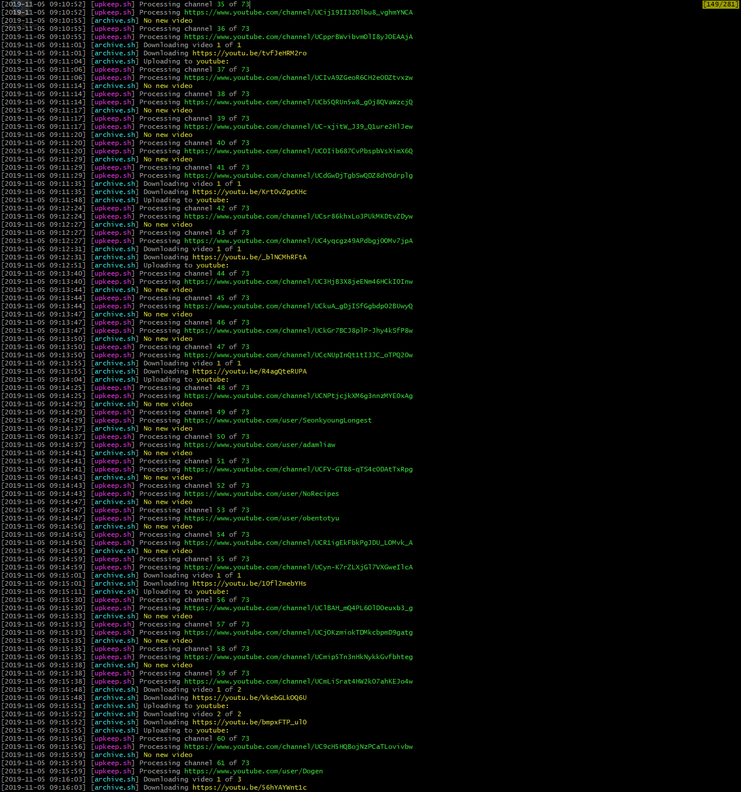

# Current version
2.2.0

# Screenshot example
<h1 align="center">
  </img>
</h1>

# Requirements
- `jq`
- `python`

# Getting started

(Omit step 2 and 3 if you just want to store the files locally (THIS IS NOT SUPPORTED YET. YOU MUST SETUP RCLONE.))

1. Edit `nagare_path` in `config/config.json` to the full path to `Nagare` folder.
2. Setup `bin/rclone config` for remote storage.
3. Edit `destination` in `config/config.json` to the name of your remote storage.
4. Create `config/channels.txt` and write each YouTube channel URL on a new line.
5. Make a cron job (adjust the frequency as needed).
```
0 0 * * * /path/to/nagare/src/upkeep.sh
```

# Additional helpful scripts

**Remove dupes**
```bash
src/dedupe.sh
```
Removes duplicate(by ID) files in remote storage and in `archive.txt`.

# TODO

- script to check if a specific ID is in remote storage AND archive.txt
- option to store locally
- script to delete a channel from remote storage AND archive.txt
